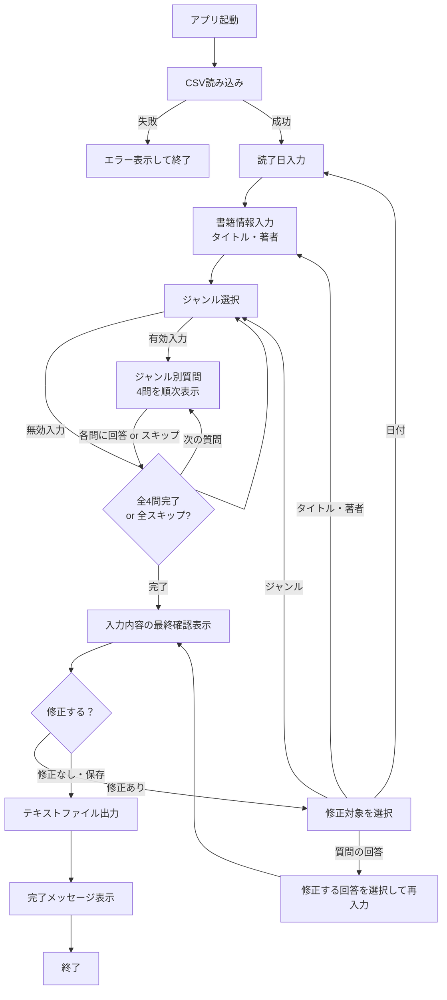

# 読書感想記録メーカー — ソフトウェア仕様書

> **バージョン**: 1.0  
> **作成日**: 2026-08-13  
> **言語**: C++ (コンソールアプリケーション)  
> **対応OS**: Windows (Shift-JIS / UTF-8 対応)

---

## 1. 概要

### 1.1 目的
読んだ本について、ジャンル別の質問に答えることで読書感想を記録し、テキストファイル（`.txt`）として出力するコンソールアプリケーション。

### 1.2 主な特徴
- ジャンル別に最適化された4つの質問で感想を構造化
- 質問内容はCSVファイルから読み込み（外部編集可能）
- スキップ機能により1問だけでも保存可能
- 最終確認・修正機能付き
- 想定外の入力に対する安全なエラーハンドリング

---

## 2. システム構成

### 2.1 ファイル構成

```
ReadingRecordMaker/
├── include/                          // ヘッダーファイル群
│   ├── Question.hpp                  // 質問データのクラス定義
│   ├── CsvLoader.hpp                 // CSVファイルの読み込み
│   ├── ConsoleUI.hpp                 // 入出力・対話処理・エラーハンドリング
│   └── RecordExporter.hpp            // テキストファイルの出力
├── src/                              // ソースファイル群
│   ├── CsvLoader.cpp                 // CSVファイルの読み込み実装
│   ├── ConsoleUI.cpp                 // 入出力・対話処理・エラーハンドリング実装
│   ├── RecordExporter.cpp            // テキストファイルの出力実装
│   └── main.cpp                      // メイン処理（全体の制御フロー）
├── output/                           // 出力先ディレクトリ（自動生成）
│   └── *.txt                         // 生成された感想ファイル
└── book_review_questions.csv         // 質問データ（外部ファイル）
```

### 2.2 使用するデータクラス

> [!IMPORTANT]
> カプセル化によりデータの整合性を保証するため、`struct` ではなく `class`（private メンバ + public getter/setter）を採用する。

#### `Question.hpp` — 質問データクラス

```cpp
// 質問セットクラス（CSVから読み込んだ後は読み取り専用）
class QuestionSet {
private:
    std::string genreName_;                // ジャンル名（例："小説・物語"）
    std::vector<std::string> questions_;   // 質問文の配列（4問）

public:
    // コンストラクタ
    QuestionSet(const std::string& genreName,
                const std::vector<std::string>& questions);

    // getter（読み取り専用）
    const std::string& getGenreName() const;
    const std::vector<std::string>& getQuestions() const;
    const std::string& getQuestion(int index) const;  // 0-indexed
    int getQuestionCount() const;
};
```

#### `Question.hpp` — 感想レコードクラス

```cpp
// 感想レコードクラス（ユーザー入力を管理、setterでバリデーション）
class ReadingRecord {
private:
    std::string date_;                     // 読了日（入力値そのまま）
    std::string title_;                    // 書籍タイトル
    std::string author_;                   // 著者名
    int genreIndex_;                       // 選択したジャンル番号（0-indexed）
    std::string genreName_;                // ジャンル名
    std::vector<std::string> answers_;     // 各質問への回答（最大4件）

public:
    // コンストラクタ
    ReadingRecord();

    // setter（バリデーション付き）
    bool setDate(const std::string& date);       // 形式チェック後に設定
    bool setTitle(const std::string& title);     // 空文字チェック
    bool setAuthor(const std::string& author);   // 空文字チェック
    void setGenre(int index, const std::string& name);
    void setAnswers(const std::vector<std::string>& answers);
    void setAnswer(int index, const std::string& answer);  // 個別修正用

    // getter
    const std::string& getDate() const;
    const std::string& getTitle() const;
    const std::string& getAuthor() const;
    int getGenreIndex() const;
    const std::string& getGenreName() const;
    const std::vector<std::string>& getAnswers() const;
    const std::string& getAnswer(int index) const;
};
```

#### class 採用の設計方針

| 観点 | 方針 |
|------|------|
| **QuestionSet** | CSVから読み込んだ後は変更不要 → コンストラクタで初期化、getter のみ提供 |
| **ReadingRecord** | ユーザー入力で段階的に構築・修正される → setter でバリデーションを実施 |
| **メンバ命名** | 末尾アンダースコア `_` でメンバ変数を明示（Google C++ Style） |

---

## 3. CSVファイル仕様

### 3.1 ファイル名
`book_review_questions.csv`

### 3.2 フォーマット

```
ジャンル番号,ジャンル名,質問番号,質問文
```

### 3.3 CSVデータ内容

```csv
1,小説・物語,1,一番印象に残った登場人物は誰？（好き・嫌い・気になった理由も）
1,小説・物語,2,一番息をのんだ「名シーン」や「名台詞」はどこ？
1,小説・物語,3,この本を読んでいる時、心に一番残った感情は？
1,小説・物語,4,もし自分が物語の中に入れたら、どの場面で主人公にどんな声をかけたい？
2,実用書,1,「これはすぐ使える！」と膝を打ったテクニックやノウハウは？
2,実用書,2,読んだ今日・明日から、具体的に試してみたい「小さな一歩（ToDo）」は？
2,実用書,3,逆に「これは今の自分には合わない・不要だ」と思った部分は？
2,実用書,4,この本の要点を、まだ読んでいない友達に一言で教えるなら？
3,ビジネス・自己啓発,1,ページをめくる手が止まった「ハイライトしたい一言（フレーズ）」は？
3,ビジネス・自己啓発,2,今までの自分の「常識」や「言い訳」を打ち砕かれた部分はどこ？
3,ビジネス・自己啓発,3,この本を読む前と読んだ後で、自分の「行動」や「選択」はどう変わりそう？
3,ビジネス・自己啓発,4,1ヶ月後の自分が忘れないように、スマホの待受けにしたいレベルの「教訓」は？
4,専門書・学習書,1,この本を読む前と後で、一番「解像度が上がった」概念やテーマは？
4,専門書・学習書,2,専門用語や理論の中で、「なるほど、そういうことか！」とスッキリした部分は？
4,専門書・学習書,3,読んでいて「ここをもっと調べたい」「まだ謎が残る」と思った課題は？
4,専門書・学習書,4,この知識を手に入れたことで、次に読んでみたい本や挑戦したいステップは？
5,ノンフィクション・伝記,1,主人公（または登場人物）の「生き方」や「決断」で、一番震えたシーンは？
5,ノンフィクション・伝記,2,自分がもし同じ時代・同じ立場にいたら、同じ決断ができたと思う？
5,ノンフィクション・伝記,3,この本を読む前と後で、ニュースや世の中に対する「見え方」はどう変わった？
5,ノンフィクション・伝記,4,著者の情熱や生き方から、自分の人生に「感染」させたいエネルギーや姿勢は？
```

### 3.4 CSV読み込み仕様

| 項目 | 仕様 |
|------|------|
| 文字コード | UTF-8（BOM無し推奨。BOM付きにも対応すること） |
| 区切り文字 | カンマ `,` |
| 改行コード | CR+LF または LF |
| ヘッダ行 | なし |
| 読み込み先 | `QuestionSet` クラスの配列（`std::vector<QuestionSet>`） |
| 読み込み担当 | `CsvLoader` クラス |
| エラー処理 | ファイル不在時・パース失敗時はエラーメッセージを表示し安全に終了 |

---

## 4. 画面フロー・処理フロー

### 4.1 全体フローチャート



---

## 5. 各画面の詳細仕様

### 5.1 起動・CSV読み込み

**処理内容**:
1. `CsvLoader::load()` で `book_review_questions.csv` を実行ファイルと同じディレクトリから読み込む
2. 各行をパースし、ジャンル番号をキーに `QuestionSet` クラスのインスタンスを生成し配列へ格納
3. 5ジャンル × 4問 = 20行が正常に読み込めたことを検証

**エラー時の表示**:
```
[エラー] book_review_questions.csv が見つかりません。
プログラムと同じフォルダに book_review_questions.csv を配置してください。
```

---

### 5.2 読了日入力

**表示**:
```
┌─────────────────────────────────────────────┐
│  📖 読書感想記録メーカー                      │
└─────────────────────────────────────────────┘

【いつ頃読了しましたか？
  覚えていれば6桁の数字(260101)、
  覚えていなければ何年+何月(2601)または何年+季節(26春)を入力して】

> 
```

**入力仕様**:

| パターン | 例 | 説明 | バリデーション |
|----------|------|------|----------------|
| 6桁数字 | `260801` | 年月日（YY年MM月DD日） | 月:01〜12, 日:01〜31 |
| 4桁数字 | `2604` | 年月（YY年MM月） | 月:01〜12 |
| 2桁数字+季節 | `26春` | 年+季節 | 季節: 春/夏/秋/冬 |

**入力変数**: `date`（入力値をそのまま文字列として保持）

**バリデーション**:
- 上記パターンのいずれにも合致しない場合 → 再入力を促す
- 表示例: `入力形式が正しくありません。例：260801, 2604, 26春`

---

### 5.3 書籍情報入力

**表示**:
```
【OK！まずは書籍の情報を教えてください】

本のタイトルは？(50文字以内)
> 

著者は？(50文字以内)
> 
```

**入力変数**:
- `title` — 書籍タイトル（空欄不可）
- `author` — 著者名（空欄不可）

- setTitle / setAuthor に「最大文字数チェック（50文字）」を追加

**バリデーション**:
- 空文字の場合 → `タイトル（著者名）を入力してください。` と再入力を促す
- 51文字以上入力された場合 → '50文字以内で入力してください。' と表示して再入力を促す。

---

### 5.4 ジャンル選択

**表示**:
```
【OK！次は本のジャンルを教えてください】

① 小説・物語
② 実用書
③ ビジネス・自己啓発
④ 専門書・学習書
⑤ ノンフィクション・伝記

番号を入力してください (1〜5)
> 
```

**入力変数**: `genreIndex`（整数 1〜5）

**バリデーション**:
- 1〜5以外の入力 → `1〜5の番号で入力してください。` と再入力を促す

**ジャンル選び直し機能**:
- ジャンル確定後、質問表示の前に確認を挟む

```
「小説・物語」でよろしいですか？ (y/n)
> 
```
- `n` の場合 → ジャンル選択に戻る
- `y` または Enter → 次へ進む

---

### 5.5 ジャンル別質問（4問）

**表示例（1問目）**:
```
━━━━━━━━━━━━━━━━━━━━━━━━━━━━━━━━━━━
  📝 質問 1/4
━━━━━━━━━━━━━━━━━━━━━━━━━━━━━━━━━━━

一番印象に残った登場人物は誰？（好き・嫌い・気になった理由も）

※ 改行したい場合は文末に \ を入力してEnterで次の行へ
※ 回答を終了するには空行でEnterを押してください
※ この質問をスキップするには「skip」と入力してください(未入力でEnter入力でも次の入力に進みます)

> 
```

**入力仕様**:

| 操作 | 入力方法 | 説明 |
|------|----------|------|
| 回答入力 | テキスト入力 | 自由記述 |
| 改行 | 行末に `\` を入力しEnter | 回答内で改行を反映 |
| 回答確定 | 空行でEnter | 現在の回答を確定し次の質問へ |
| スキップ | `skip` と入力または何も入力せずにEnter | この質問をスキップ（回答なしで次へ） |

> [!IMPORTANT]
> **スキップ機能**: 1問でも回答があれば保存可能。全問スキップした場合でもファイルは生成する（質問のみ記載、回答は「(スキップ)」と表記）。

**回答の複数行入力の実装方針**:
```
> 主人公の田中が印象的でした。\
> 彼の決断力と、最後まで諦めない姿勢が\
> 自分の仕事にも通じると思いました。
> （空行Enter → 確定）
```
上記は内部的に以下のように結合して保持する:
```
主人公の田中が印象的でした。
彼の決断力と、最後まで諦めない姿勢が
自分の仕事にも通じると思いました。
```

---

### 5.6 最終確認・修正

**表示例**:
```
━━━━━━━━━━━━━━━━━━━━━━━━━━━━━━━━━━━
  ✅ 入力内容の確認
━━━━━━━━━━━━━━━━━━━━━━━━━━━━━━━━━━━

[1] 読了日     : 260801
[2] タイトル   : 人間失格
[3] 著者       : 太宰治
[4] ジャンル   : 小説・物語

--- 質問と回答 ---

[5] 【質問1】一番印象に残った登場人物は誰？（好き・嫌い・気になった理由も）
    → 主人公の葉蔵。彼の弱さに共感した。

[6] 【質問2】一番息をのんだ「名シーン」や「名台詞」はどこ？
    → 「恥の多い生涯を送って来ました」という冒頭。

[7] 【質問3】この本を読んでいる時、心に一番残った感情は？
    → (スキップ)

[8] 【質問4】もし自分が物語の中に入れたら、どの場面で主人公にどんな声をかけたい？
    → 堀木と別れるシーンで「もう会わなくていい」と言いたい。

━━━━━━━━━━━━━━━━━━━━━━━━━━━━━━━━━━━

修正したい項目の番号を入力してください（修正なしなら Enter で保存）
> 
```

**修正フロー**:

| 入力 | 動作 |
|------|------|
| `1` | 読了日を再入力 → 確認画面に戻る |
| `2` | タイトルを再入力 → 確認画面に戻る |
| `3` | 著者を再入力 → 確認画面に戻る |
| `4` | ジャンル再選択 → **質問も再出題**（回答リセット）→ 確認画面に戻る |
| `5`〜`8` | 該当する質問の回答を再入力 → 確認画面に戻る |
| Enter（空） | 修正なし → ファイル保存処理へ |
| `q` | 保存せず終了（確認あり） |

> [!WARNING]
> ジャンルを修正した場合、質問内容が変わるため回答はリセットされる。修正前に「ジャンルを変更すると回答がリセットされます。よろしいですか？(y/n)」と確認を表示する。

---

## 6. ファイル出力仕様

### 6.1 ファイル名

**形式**: `date_title_author.txt`

| 要素 | 内容 | 例 |
|------|------|-----|
| `date` | 入力された読了日 | `260801` |
| `title` | 書籍タイトル | `人間失格` |
| `author` | 著者名 | `太宰治` |

**完成例**: `260801_人間失格_太宰治.txt`

**ファイル名のサニタイズ**:
- ファイル名に使用できない文字（`\ / : * ? " < > |`）はアンダースコア `_` に置換
- 前後の空白はトリム

### 6.2 出力先

- 実行ファイルと同じディレクトリ内の `output/` フォルダ
- `output/` フォルダが存在しない場合は自動生成

### 6.3 出力ファイルのフォーマット

```
人間失格　太宰治　読了日：260801
小説・物語

【質問1】一番印象に残った登場人物は誰？（好き・嫌い・気になった理由も）
主人公の葉蔵。彼の弱さに共感した。

【質問2】一番息をのんだ「名シーン」や「名台詞」はどこ？
「恥の多い生涯を送って来ました」という冒頭。

【質問3】この本を読んでいる時、心に一番残った感情は？
(スキップ)

【質問4】もし自分が物語の中に入れたら、どの場面で主人公にどんな声をかけたい？
堀木と別れるシーンで「もう会わなくていい」と言いたい。

```

**フォーマット詳細**:

```
{title}　{author}　読了日：{date}    ← 見出し行（全角スペース区切り）
{genreName}                           ← ジャンル名
                                      ← 空行
【質問1】{question1}                  ← 質問文
{answer1}                             ← 回答（複数行可）
                                      ← 空行
【質問2】{question2}
{answer2}
                                      ← 空行
【質問3】{question3}
{answer3}
                                      ← 空行
【質問4】{question4}
{answer4}
                                      ← 空行（末尾）
```

### 6.4 文字コード
- 出力ファイルの文字コードは **UTF-8（BOM付き）** とする
- Windows のメモ帳で正しく表示されることを保証するため

### 6.5 同名ファイルの扱い
- 同名ファイルが既に存在する場合、上書きするか末尾に連番を付与するか確認する


```
同名のファイルが既に存在します。
[1] 上書きする
[2] 別名で保存する（連番付与）
> 
```

- 連番形式: `260801_人間失格_太宰治_2.txt`


### 6.6 output/ への保存に失敗した場合
- コンソール上でユーザーに次のアクションを選択させる
- RecordExporter に「保存失敗時のフォールバック処理（デスクトップ保存等の選択）」を追加

､､､
[エラー] output/ フォルダへの書き込みに失敗しました。

どうしますか？
[1] デスクトップに保存を試みる
[2] 別の保存先パスを直接入力する
[3] 再試行する
[4] 保存せずに終了する
､､､

デスクトップパスの取得:
C++では環境変数 %USERPROFILE% を取得して \Desktop を結合することで、実行ユーザーのデスクトップパス（例: C:\Users\Username\Desktop）を簡単に取得できます。

代替パスの入力:
ユーザーが任意のフォルダパス（例: C:\temp）を入力できるようにしておくと、権限エラーを柔軟に回避できます。

---

## 7. エラーハンドリング

### 7.1 想定されるエラーと対処

| エラー | 検出方法 | 対処 |
|--------|----------|------|
| CSV不在 | `ifstream` の `is_open()` | エラーメッセージ表示 → 安全に終了 |
| CSVフォーマット不正 | パース時のカラム数チェック | エラー行番号を表示 → 安全に終了 |
| 空入力（必須項目） | `empty()` チェック | 再入力を促す |
| 数値入力に文字 | `cin.fail()` / 正規表現チェック | 入力バッファをクリアし再入力を促す |
| ファイル書き込み失敗 | `ofstream` の状態チェック | エラーメッセージ表示 → 安全に終了 |
| 出力ディレクトリ作成失敗 | `filesystem::create_directory` の戻り値 | エラーメッセージ表示 → 安全に終了 |
| Ctrl+C による中断 | シグナルハンドラ（`SIGINT`） | 「保存せずに終了します」と表示し正常終了 |
| EOFの検出 | `cin.eof()` | 安全にリソースを解放して終了 |

### 7.2 安全終了のポリシー
- いかなる場合もクラッシュさせない
- 開いたファイルハンドルは必ず閉じる
- 途中で終了する場合は未完成ファイルを残さない

---

## 8. モジュール・関数設計

### 8.1 モジュール構成と責務

| モジュール | ヘッダ | ソース | 責務 |
|------------|--------|--------|------|
| **Question** | `Question.hpp` | *(ヘッダのみ or hpp内に実装)* | `QuestionSet` / `ReadingRecord` クラスの定義 |
| **CsvLoader** | `CsvLoader.hpp` | `CsvLoader.cpp` | CSVファイルの読み込みとパース |
| **ConsoleUI** | `ConsoleUI.hpp` | `ConsoleUI.cpp` | 全ての対話処理（入力・表示・バリデーション） |
| **RecordExporter** | `RecordExporter.hpp` | `RecordExporter.cpp` | テキストファイルの生成と出力 |

---

### 8.2 CsvLoader — CSV読み込みモジュール

```cpp
// CsvLoader.hpp
class CsvLoader {
public:
    // CSVファイルを読み込み、QuestionSetの配列を返す
    // 失敗時は空のvectorを返し、エラーメッセージを標準エラーに出力
    static std::vector<QuestionSet> load(const std::string& filepath);

private:
    static std::string trimString(const std::string& str);
    static std::vector<std::string> parseLine(const std::string& line);
};
```

---

### 8.3 ConsoleUI — 対話処理モジュール

```cpp
// ConsoleUI.hpp
class ConsoleUI {
public:
    // 各入力フェーズ
    static std::string inputDate();                                           // 読了日入力
    static std::string inputTitle();                                          // タイトル入力
    static std::string inputAuthor();                                         // 著者入力
    static int selectGenre(const std::vector<QuestionSet>& questions);        // ジャンル選択（0-indexed）
    static std::vector<std::string> askQuestions(const QuestionSet& qs);      // 4問の質問と回答収集

    // 最終確認・修正
    static void displayConfirmation(const ReadingRecord& record,
                                    const std::vector<QuestionSet>& questions);
    static bool editRecord(ReadingRecord& record,
                           const std::vector<QuestionSet>& questions);        // 修正ありならtrue

    // タイトル画面表示
    static void showTitle();

private:
    static std::string inputMultiLine();        // 複数行入力
    static bool validateDate(const std::string& date);  // 日付バリデーション
};
```

---

### 8.4 RecordExporter — ファイル出力モジュール

```cpp
// RecordExporter.hpp
class RecordExporter {
public:
    // ReadingRecordをテキストファイルに出力。成功時true
    static bool exportToFile(const ReadingRecord& record,
                             const std::vector<QuestionSet>& questions);

private:
    static std::string sanitizeFilename(const std::string& name);
    static std::string buildFilename(const ReadingRecord& record);
    static std::string buildContent(const ReadingRecord& record,
                                    const std::vector<QuestionSet>& questions);
    static bool handleDuplicate(const std::string& filepath);  // 同名ファイル処理
};
```

---

### 8.5 処理フロー（main.cpp）

```cpp
#include "Question.hpp"
#include "CsvLoader.hpp"
#include "ConsoleUI.hpp"
#include "RecordExporter.hpp"

int main() {
    // 1. CSV読み込み
    auto questions = CsvLoader::load("book_review_questions.csv");
    if (questions.empty()) return 1;

    // 2. タイトル画面表示
    ConsoleUI::showTitle();

    // 3. 読了日入力
    ReadingRecord record;
    record.setDate(ConsoleUI::inputDate());

    // 4. 書籍情報入力
    record.setTitle(ConsoleUI::inputTitle());
    record.setAuthor(ConsoleUI::inputAuthor());

    // 5. ジャンル選択
    int gi = ConsoleUI::selectGenre(questions);
    record.setGenre(gi, questions[gi].getGenreName());

    // 6. 質問 & 回答
    record.setAnswers(ConsoleUI::askQuestions(questions[gi]));

    // 7. 最終確認 & 修正ループ
    bool editing = true;
    while (editing) {
        ConsoleUI::displayConfirmation(record, questions);
        editing = ConsoleUI::editRecord(record, questions);
    }

    // 8. ファイル出力
    if (RecordExporter::exportToFile(record, questions)) {
        // 完了メッセージはexportToFile内で表示
    }

    return 0;
}
```

---

## 9. 使用するC++標準ライブラリ

| ライブラリ | 用途 |
|------------|------|
| `<iostream>` | コンソール入出力 |
| `<fstream>` | ファイル読み書き |
| `<sstream>` | CSVパース用文字列ストリーム |
| `<string>` | 文字列操作 |
| `<vector>` | 動的配列 |
| `<regex>` | 日付入力のバリデーション |
| `<filesystem>` | 出力ディレクトリの作成・存在チェック |
| `<csignal>` | Ctrl+Cのシグナルハンドリング |
| `<algorithm>` | 文字列トリム等のユーティリティ |

**C++標準**: C++17 以上（`<filesystem>` の使用のため）

---

## 10. 画面表示サンプル（完全フロー）

```
┌─────────────────────────────────────────────┐
│  📖 読書感想記録メーカー                      │
└─────────────────────────────────────────────┘

【いつ頃読了しましたか？
  覚えていれば6桁の数字(260101)、
  覚えていなければ何年+何月(2601)または何年+季節(26春)を入力して】

> 260801

【OK！まずは書籍の情報を教えてください】

本のタイトルは？
> 人間失格

著者は？
> 太宰治

【OK！次は本のジャンルを教えてください】

① 小説・物語
② 実用書
③ ビジネス・自己啓発
④ 専門書・学習書
⑤ ノンフィクション・伝記

番号を入力してください (1〜5)
> 1

「小説・物語」でよろしいですか？ (y/n)
> y

━━━━━━━━━━━━━━━━━━━━━━━━━━━━━━━━━━━
  📝 質問 1/4
━━━━━━━━━━━━━━━━━━━━━━━━━━━━━━━━━━━

一番印象に残った登場人物は誰？（好き・嫌い・気になった理由も）

※ 改行したい場合は文末に \ を入力してEnterで次の行へ
※ 回答を終了するには空行でEnterを押してください
※ この質問をスキップするには「skip」と入力してください

> 主人公の葉蔵。\
> 自分の弱さを自覚しながらも変われない姿に、\
> どうしようもなく共感してしまった。
>

━━━━━━━━━━━━━━━━━━━━━━━━━━━━━━━━━━━
  📝 質問 2/4
━━━━━━━━━━━━━━━━━━━━━━━━━━━━━━━━━━━

一番息をのんだ「名シーン」や「名台詞」はどこ？

※ 改行したい場合は文末に \ を入力してEnterで次の行へ
※ 回答を終了するには空行でEnterを押してください
※ この質問をスキップするには「skip」と入力してください

> 「恥の多い生涯を送って来ました」という冒頭の一文。
>

━━━━━━━━━━━━━━━━━━━━━━━━━━━━━━━━━━━
  📝 質問 3/4
━━━━━━━━━━━━━━━━━━━━━━━━━━━━━━━━━━━

この本を読んでいる時、心に一番残った感情は？

※ 改行したい場合は文末に \ を入力してEnterで次の行へ
※ 回答を終了するには空行でEnterを押してください
※ この質問をスキップするには「skip」と入力してください

> skip

（質問3をスキップしました）

━━━━━━━━━━━━━━━━━━━━━━━━━━━━━━━━━━━
  📝 質問 4/4
━━━━━━━━━━━━━━━━━━━━━━━━━━━━━━━━━━━

もし自分が物語の中に入れたら、どの場面で主人公にどんな声をかけたい？

※ 改行したい場合は文末に \ を入力してEnterで次の行へ
※ 回答を終了するには空行でEnterを押してください
※ この質問をスキップするには「skip」と入力してください

> 堀木と別れるシーンで「もう会わなくていい」と言いたい。
>

━━━━━━━━━━━━━━━━━━━━━━━━━━━━━━━━━━━
  ✅ 入力内容の確認
━━━━━━━━━━━━━━━━━━━━━━━━━━━━━━━━━━━

[1] 読了日     : 260801
[2] タイトル   : 人間失格
[3] 著者       : 太宰治
[4] ジャンル   : 小説・物語

--- 質問と回答 ---

[5] 【質問1】一番印象に残った登場人物は誰？（好き・嫌い・気になった理由も）
    → 主人公の葉蔵。
      自分の弱さを自覚しながらも変われない姿に、
      どうしようもなく共感してしまった。

[6] 【質問2】一番息をのんだ「名シーン」や「名台詞」はどこ？
    → 「恥の多い生涯を送って来ました」という冒頭の一文。

[7] 【質問3】この本を読んでいる時、心に一番残った感情は？
    → (スキップ)

[8] 【質問4】もし自分が物語の中に入れたら、どの場面で主人公にどんな声をかけたい？
    → 堀木と別れるシーンで「もう会わなくていい」と言いたい。

━━━━━━━━━━━━━━━━━━━━━━━━━━━━━━━━━━━

修正したい項目の番号を入力してください（修正なしなら Enter で保存）
>

📁 ファイルを保存しました！
   output/260801_人間失格_太宰治.txt

ご利用ありがとうございました！📚
```

---

## 11. 補足事項

### 11.1 拡張性への配慮
- 質問内容はCSV外部ファイルで管理するため、プログラムを再コンパイルせずに質問の追加・変更が可能
- ジャンル数や質問数を増やす場合もCSVの行を追加するだけで対応可能（ただし質問数の変動に対応するには `askQuestions` の修正が必要）

### 11.2 今後の拡張案（本仕様の対象外）
- 感情タグ選択機能（小説ジャンル質問3用）
- 過去の記録の一覧表示・検索機能
- 記録の統計機能（月ごとの読書冊数など）
- JSON形式での出力オプション
- 対象ジャンルの追加
